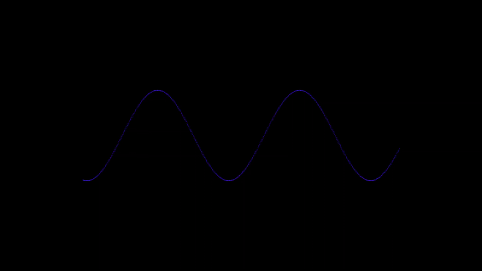

This is an implementation of Bresenham's Line Algorithm
Bresenham, J. E., “Algorithm for Computer Control of a Digital Plotter”, IBM Systems Journal, 1965.

This algorithm laid the foundation for modern raster graphics. Pretty cool!

# Demo



# Features

- CPU-based Bresenham line rasterization.
- Animated line endpoints (Sinusoidal motion).
- Shader-based coloring with time-based effects.

# Prerequisites

- C++17 compiler
- GLFW
- GLAD
- GLM
- stb_image.h (not really but I'm using a template I made for VS that includes this)

# Building

1. Clone the repository:
```git clone https://github.com/yourusername/bresenham-opengl.git
cd bresenham-opengl
```
2. Compile: (this example uses g++)
```g++ main.cpp -o bresenham -lglfw -ldl -lGL```
3. Ensure vertex_shader.glsl and fragment_shader.glsl are in the same folder as the executable.

# Running

```./bresenham```
Press ESC to close the window
Observe the moving line

# Bresenham Line Algorithm

Generates discrete line points using integer arithmetic.
Maps pixel coordinates to OpenGL NDC coordinates.

